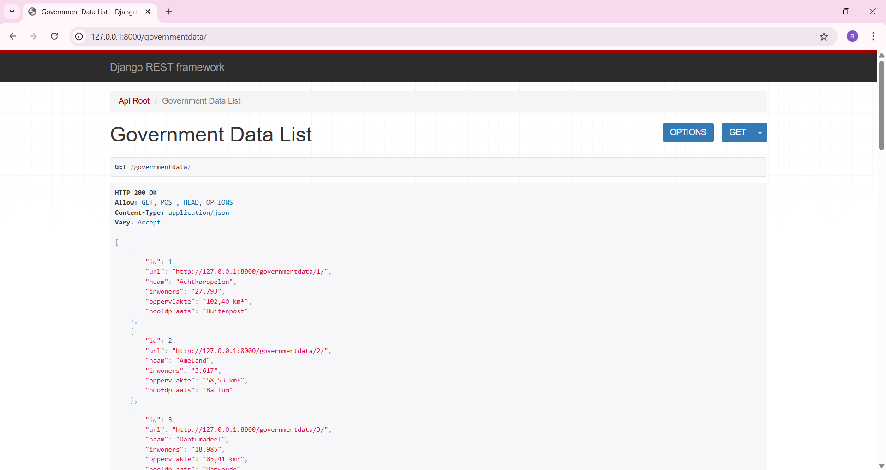
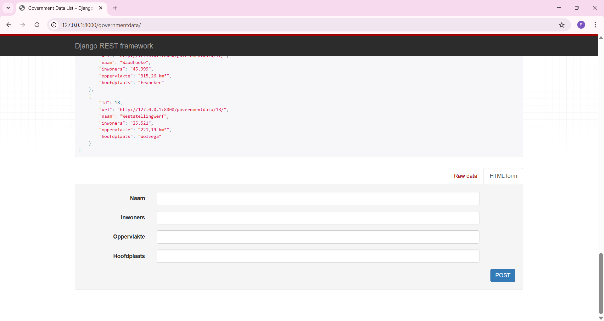

## API Django REST Framework

This project features a RESTful API built with the Django REST Framework (DRF). 
The API provides access to data regarding all local governments in the province of Friesland, Netherlands. 
It is designed to assist developers and data analysts in retrieving and analyzing information through standardized API endpoints.

### Specifications

- Implementation: Django REST Framework
- Database: SQLite
- Testing: Postman for API endpoint validation

## Images

#### API data list

#### Add new data field

